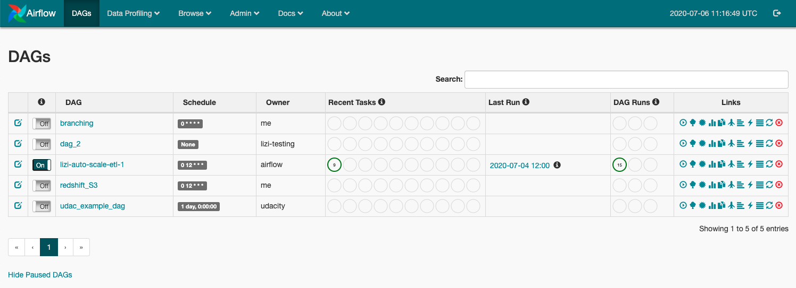
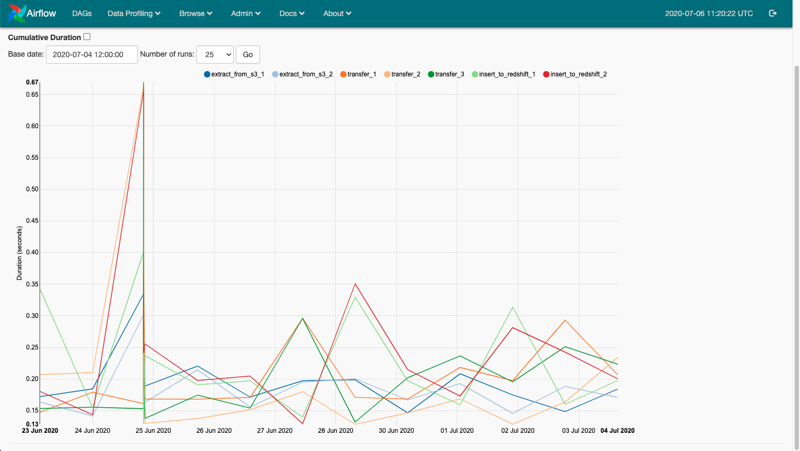
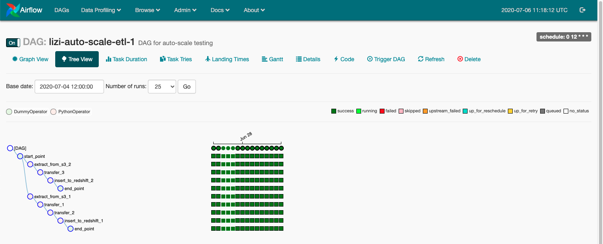
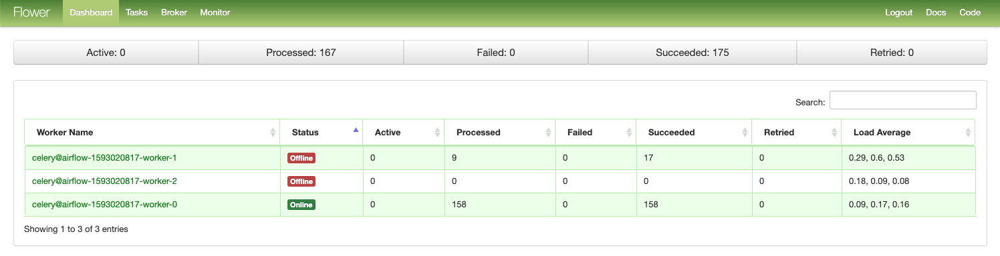
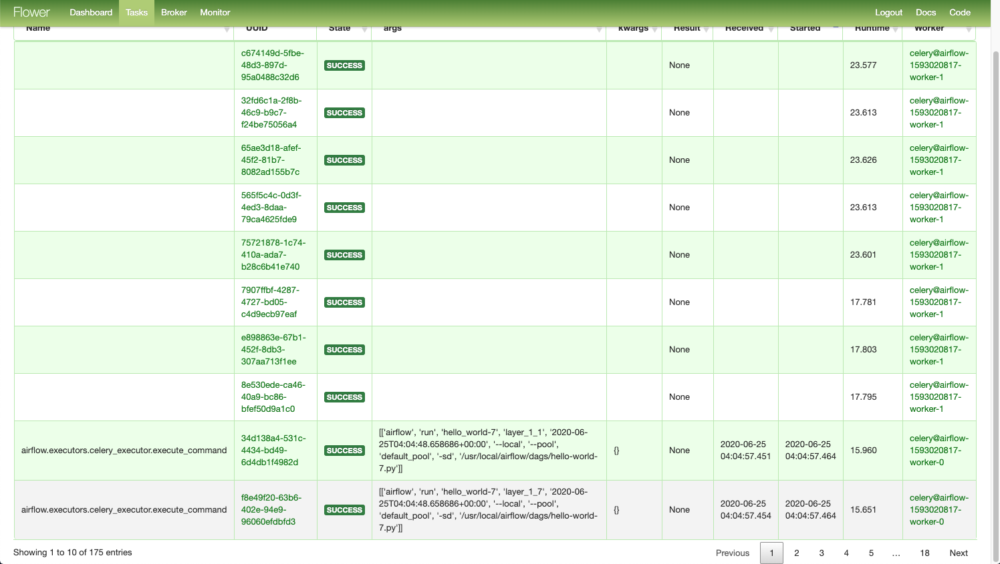

# Airflow

workflow orchestration, also able to monitoring them

use for repetitive tasks, don't change on daily basis, good for ETL job orchestration, trigger Spark

## How to use 
Concepts you need to know for sure:
- Scheduler / Executor
    - DAG: start_date / shedule_interval
    - Task Create → Queue
        - sequential: one by one, for debug and testing
        - local: concurrent, vertically, single point failure
        - celery: dispatch to woker, recommend: maintain infrastructure
        - kubernetes:L: allow run task using kubernetes - elastic to workload, avoid wasting resources
- Webserver: UI dashboard
    
    - DAGs View / DAG View /  Tree Biew / Task Dualation / Gantt View / Code View
    
    
- Flower UI: Monitoring the worker node 
    
    
- DAGs:
    - start_data/dag_id/schedule_interval/max_active_runs/catch_up

- Plugin:
- Operator / Hooks / sensors:
    - operator: excute work as a step in a workflow; sensor, when a creatia is met
    - hook: interface to external platforms and services, sensor, special type of operator, monitering events poke function
- XCom: cross-communication between tasks and operators to exchange info
    - push / pull to a database
- variables: key vaule store in airflow, query from database

## Resources 

https://kubernetes.io/blog/2018/06/28/airflow-on-kubernetes-part-1-a-different-kind-of-operator/
https://prabhatsharma.in/blog/installing-aiflow-on-kubernetes/
https://airflow.apache.org/docs/stable/concepts.html

## Pain Points 
The worst part of Airflow is the environment setup, the airflow is written by python, and need a lot
of dependency library, but since the airflow is still being developed, it is so easy to get one of the 
dependency library out-of-date. Thus people always use docker image to run airflow.

This issue is extremly important when running on kubernetes

